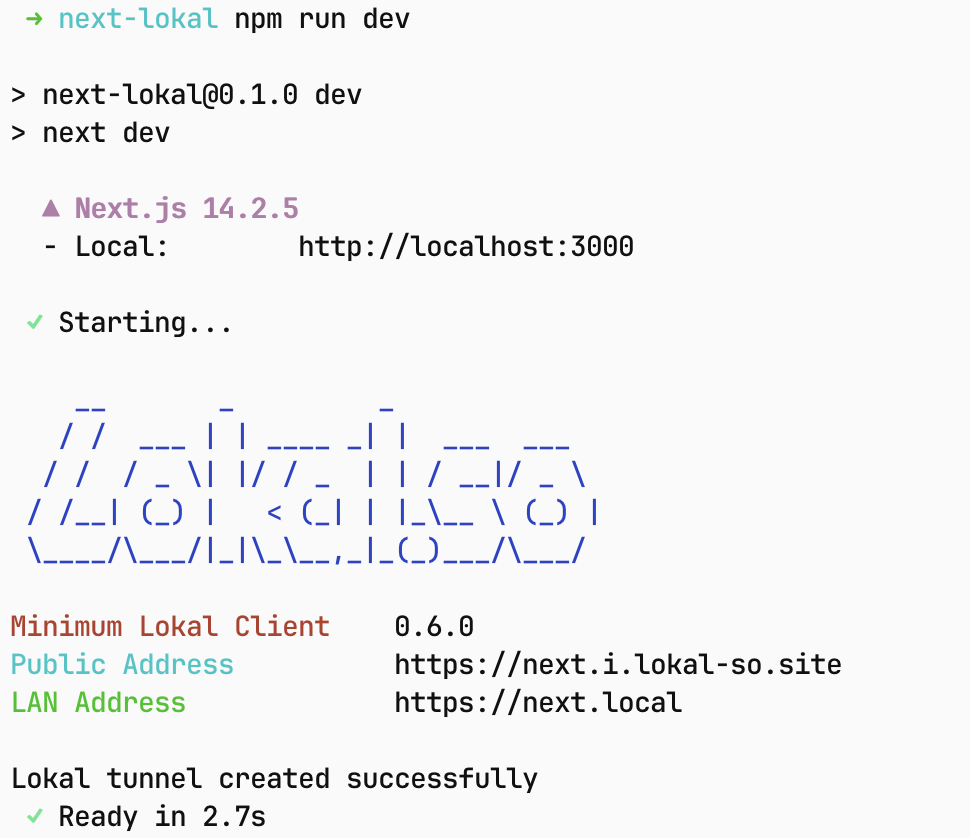
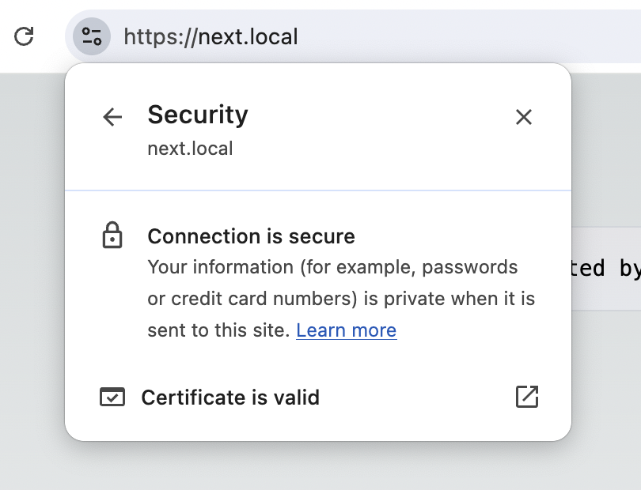

# Lokal Webpack Plugin

Webpack Plugin for Lokal JS/TS client

| CLI Preview                     | Browser Preview                     |
| ------------------------------- | ----------------------------------- |
|  |  |

## Installation

```sh
npm i lokal-webpack-plugin
```

## Usage

```javascript
// next.config.mjs
import lokalTunnel from 'lokal-webpack-plugin';

/** @type {import('next').NextConfig} */
const nextConfig = {
	reactStrictMode: true,

	webpack: (config, { dev, isServer }) => {
		if (dev && !isServer) {
			config.plugins.push(
				new lokalTunnel({
					lanAddress: 'next.local',
					publicAddress: 'next.i.lokal-so.site' // Optional: custom public address
				})
			);
		}
		return config;
	}
};

export default nextConfig;
```

## License

MIT
